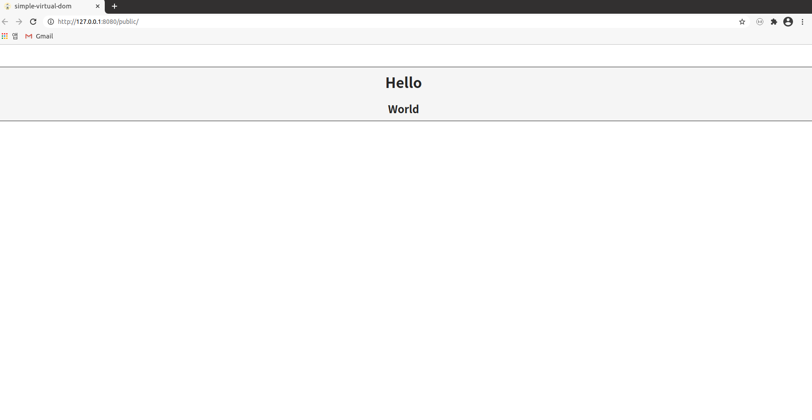

# simple-virtual-dom

A simple implementation of a virtual-dom for learning

## Install and Run

1. Clone this repository

```
$ git clone https://github.com/hseoy/simple-virtual-dom.git
```

2. Install dependencies

```
$ yarn install
```

3. Run live-server

```
$ yarn start
```


